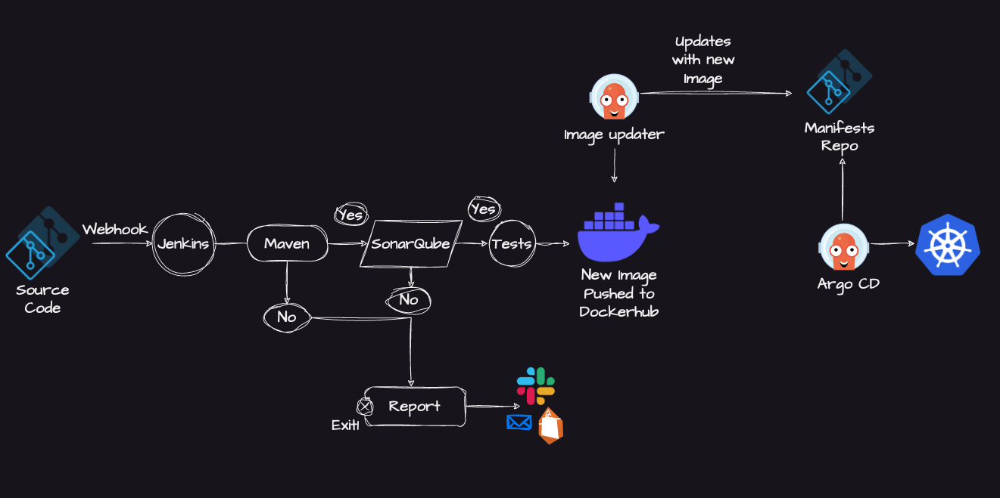
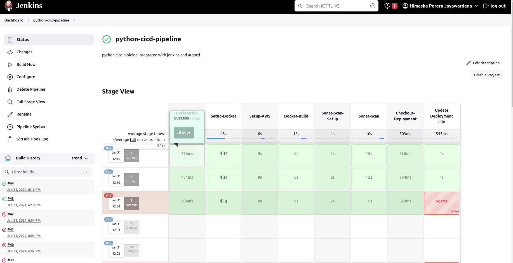
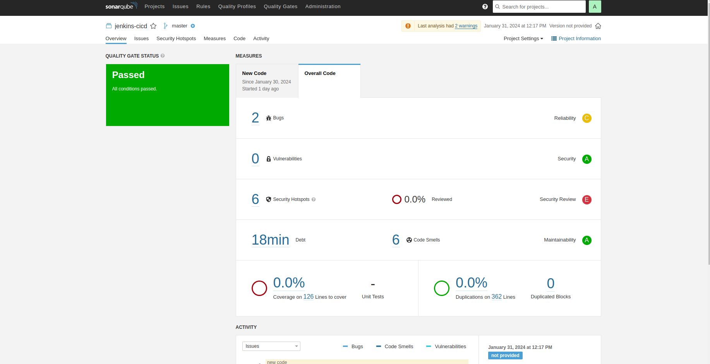
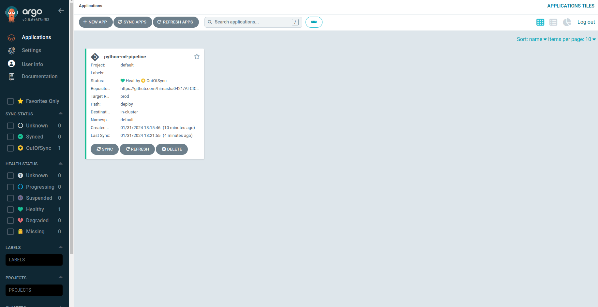
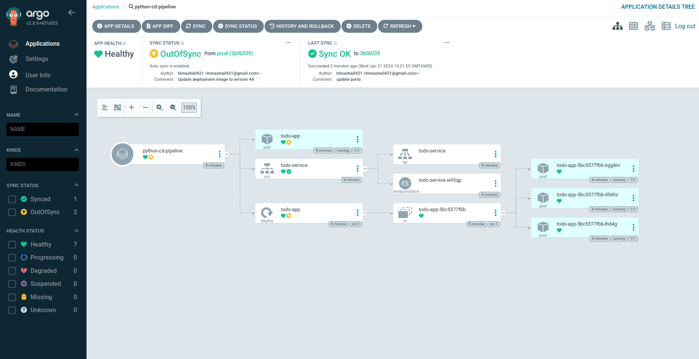

# Continuous Integration (CI) Pipeline

**Pipeline Architecture**


## Setup Jenkins inside EC2 instance

* step 1. install java package

```bash
sudo apt update
sudo apt install fontconfig openjdk-17-jre
java -version
```

* step 2. install jenkins

```bash
sudo wget -O /usr/share/keyrings/jenkins-keyring.asc \
  https://pkg.jenkins.io/debian-stable/jenkins.io-2023.key
echo deb [signed-by=/usr/share/keyrings/jenkins-keyring.asc] \
  https://pkg.jenkins.io/debian-stable binary/ | sudo tee \
  /etc/apt/sources.list.d/jenkins.list > /dev/null
sudo apt-get update
sudo apt-get install jenkins
```

* step 3. check jenkins service status

```bash
sudo systemctl status jenkins
```

> **important**

If configuration is done inside an EC2 instance, then it is necessary to open port 8080 to the public internet by configuring the EC2 instance security group.

* step4. access the jenkins server

  > get default password
  ```sudo cat /var/lib/jenkins/secrets/initialAdminPassword```

  > first install the default plugins

  > create a admin user to login after initial setup


* step 5. Install the Docker Pipeline plugin in Jenkins

Our CI/CD configuration involves managing worker nodes using Docker, offering increased scalability for large developments. This approach eliminates the need to maintain continuous worker nodes like EC2 instances, as well as the necessity of managing worker environments separately. Utilizing Docker provides greater flexibility, allowing developers to use specific Docker images and configure the environment for each CI/CD job.


1. Log in to Jenkins.
2. Go to Manage Jenkins > Manage Plugins.
3. In the Available tab, search for "Docker Pipeline".
4. Select the plugin and click the Install button.
5. Restart Jenkins after the plugin is installed.

* step 6. Docker Slave Configuration

```bash

# Add Docker's official GPG key:
sudo apt-get update
sudo apt-get install ca-certificates curl gnupg
sudo install -m 0755 -d /etc/apt/keyrings
curl -fsSL https://download.docker.com/linux/ubuntu/gpg | sudo gpg --dearmor -o /etc/apt/keyrings/docker.gpg
sudo chmod a+r /etc/apt/keyrings/docker.gpg

# Add the repository to Apt sources:
echo \
  "deb [arch=$(dpkg --print-architecture) signed-by=/etc/apt/keyrings/docker.gpg] https://download.docker.com/linux/ubuntu \
  $(. /etc/os-release && echo "$VERSION_CODENAME") stable" | \
  sudo tee /etc/apt/sources.list.d/docker.list > /dev/null
sudo apt-get update

sudo apt-get install docker-ce docker-ce-cli containerd.io docker-buildx-plugin docker-compose-plugin
```

* step 7. Grant Jenkins user and Ubuntu user permission to docker deamon.

```bash

sudo su - 
usermod -aG docker jenkins
usermod -aG docker ubuntu
systemctl restart docker
```

* step 8. Once you are done with the above steps, it is better to restart Jenkins.

#### jenkins basic setup completed ...


## Create Github webhook


* step1. go to the github project -> settings -> Webhooks

* step2. click add webhook

```
Payload URL -> http://<Jenkins server public ip>:<jenkins port>/github-webhook/
Content type -> application/json
```
* step3. save the configuration

## Configure EC2 instance IAM role to push docker images to ECR


To configure an EC2 instance IAM role to push Docker images to Amazon Elastic Container Registry (ECR), follow these steps:

**Create an IAM Role**:

Go to the AWS Management Console and navigate to the IAM service.
In the left navigation pane, choose "Roles" and then click "Create role."
Select "AWS service" as the trusted entity type and choose "EC2" as the use case.
Attach policies that provide the necessary permissions for ECR, such as AmazonEC2ContainerRegistryFullAccess or a custom policy with ecr:BatchCheckLayerAvailability, ecr:BatchGetImage, ecr:CompleteLayerUpload, ecr:InitiateLayerUpload, and ecr:PutImage permissions.

**Attach the IAM Role to EC2 Instance**:

In the AWS Management Console, navigate to the EC2 service.
Select the EC2 instance to which you want to attach the IAM role.
In the instance details pane, choose "Actions," then "Security," and then "Modify IAM Role."
Select the IAM role created in step 1 and click "Update IAM Role."


follow the instructions here : https://docs.aws.amazon.com/AWSEC2/latest/UserGuide/iam-roles-for-amazon-ec2.html


## Setup AWS EC2 instance for ECR push

```bash
curl "https://awscli.amazonaws.com/awscli-exe-linux-x86_64.zip" -o "awscliv2.zip"
sudo apt install unzip
unzip awscliv2.zip
sudo ./aws/install
aws ecr get-login-password --region <REGION> | sudo docker login --username AWS --password-stdin <AWS_ACCOUNT_ID>.dkr.ecr.us-east-1.amazonaws.com
sudo docker tag hello-world:latest <AWS_ACCOUNT_ID>.dkr.ecr.<REGION>.amazonaws.com/ai-cicd
sudo docker push <AWS_ACCOUNT_ID>.dkr.ecr.<REGION>.amazonaws.com/ai-cicd
```

## Setup sonarqube server

```bash


adduser sonarqube
wget https://binaries.sonarsource.com/Distribution/sonarqube/sonarqube-9.4.0.54424.zip
unzip *
chmod -R 755 /home/sonarqube/sonarqube-9.4.0.54424
chown -R sonarqube:sonarqube /home/sonarqube/sonarqube-9.4.0.54424
cd sonarqube-9.4.0.54424/bin/linux-x86-64/
./sonar.sh start
```

## Setup sonar scaner cli

```bash

wget https://binaries.sonarsource.com/Distribution/sonar-scanner-cli/sonar-scanner-cli-5.0.1.3006-linux.zip
unzip sonar-scanner-cli-5.0.1.3006-linux.zip
export PATH=$PATH:/home/ubuntu/sonar-scanner-5.0.1.3006-linux/bin/
cd AI-CICD-Guide/
```

> run sonar scannaer

```bash

sonar-scanner \
  -Dsonar.projectKey=jenkins-cicd \
  -Dsonar.sources=. \
  -Dsonar.host.url=http://<SONAR_SERVER_PUBLIC_IP>:9000 \
  -Dsonar.login=<SONAR_LOGIN_TOKEN>
```

> to follow the deployment cofiguration follow the prod branch readme.md file. 💜

# Final Outcome

jenkins pipeline


sonarqube server


argod cd server


